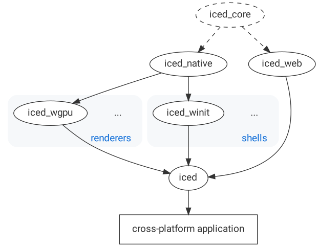

# Ecosystem
This document describes the Iced ecosystem.

It quickly lists the different audiences of the library and explains how the different crates relate to each other.

## Users

Iced is meant to be used by 2 different types of users:

- __End-users__. They should be able to:
  - get started quickly,
  - have many widgets available,
  - keep things simple,
  - and build applications that are __maintainable__ and __performant__.
- __GUI toolkit developers / Ecosystem contributors__. They should be able to:
  - build new kinds of widgets,
  - implement custom runtimes,
  - integrate existing runtimes in their own system (like game engines),
  - and create their own custom renderers.

## Crates
Iced consists of different crates which offer different layers of abstractions for our users. This modular architecture helps us keep implementation details hidden and decoupled, which should allow us to rewrite or change strategies in the future.

### [`iced_core`]

[`iced_core`] holds basic reusable types of the public API. For instance, basic data types like `Point`, `Rectangle`, `Length`, etc.

This crate is meant to be a starting point for an Iced runtime.

### [`iced_native`]
[`iced_native`] takes [`iced_core`] and builds a native runtime on top of it, featuring:
- A custom layout engine, greatly inspired by [`druid`]
- Event handling for all the built-in widgets
- A renderer-agnostic API

To achieve this, it introduces a bunch of reusable interfaces:
- A `Widget` trait, which is used to implement new widgets: from layout requirements to event and drawing logic.
- A bunch of `Renderer` traits, meant to keep the crate renderer-agnostic.
- A `Windowed` trait, leveraging [`raw-window-handle`], which can be implemented by graphical renderers that target _windows_. Window-based shells (like [`iced_winit`]) can use this trait to stay renderer-agnostic.

[`druid`]: https://github.com/xi-editor/druid
[`raw-window-handle`]: https://github.com/rust-windowing/raw-window-handle

### [`iced_web`]
[`iced_web`] takes [`iced_core`] and builds a WebAssembly runtime on top. It achieves this by introducing a `Widget` trait that can be used to produce VDOM nodes.

The crate is currently a simple abstraction layer over [`dodrio`].

[`dodrio`]: https://github.com/fitzgen/dodrio

### [`iced_wgpu`]
[`iced_wgpu`] is a [`wgpu`] renderer for [`iced_native`]. For now, it is the default renderer of Iced in native platforms.

[`wgpu`] supports most modern graphics backends: Vulkan, Metal, DX11, and DX12 (OpenGL and WebGL are still WIP). Additionally, it will support the incoming [WebGPU API].

Currently, [`iced_wgpu`] supports the following primitives:
- Text, which is rendered using [`wgpu_glyph`]. No shaping at all.
- Quads or rectangles, with rounded borders and a solid background color.
- Images, lazily loaded from the filesystem.
- Clip areas, useful to implement scrollables or hide overflowing content.

[`wgpu`]: https://github.com/gfx-rs/wgpu-rs
[WebGPU API]: https://gpuweb.github.io/gpuweb/
[`wgpu_glyph`]: https://github.com/hecrj/wgpu_glyph

### [`iced_winit`]
[`iced_winit`] offers some convenient abstractions on top of [`iced_native`] to quickstart development when using [`winit`].

It exposes a renderer-agnostic `Application` trait that can be implemented and then run with a simple call. The use of this trait is optional. A `conversion` module is provided for users that decide to implement a custom event loop.

[`winit`]: https://github.com/rust-windowing/winit

### [`iced`]
Finally, [`iced`] unifies everything into a simple abstraction to create cross-platform applications:

- On native, it uses [`iced_winit`] and [`iced_wgpu`].
- On the web, it uses [`iced_web`].

This is the crate meant to be used by __end-users__.

[`iced_core`]: core
[`iced_native`]: native
[`iced_web`]: web
[`iced_wgpu`]: wgpu
[`iced_winit`]: winit
[`iced`]: ..
